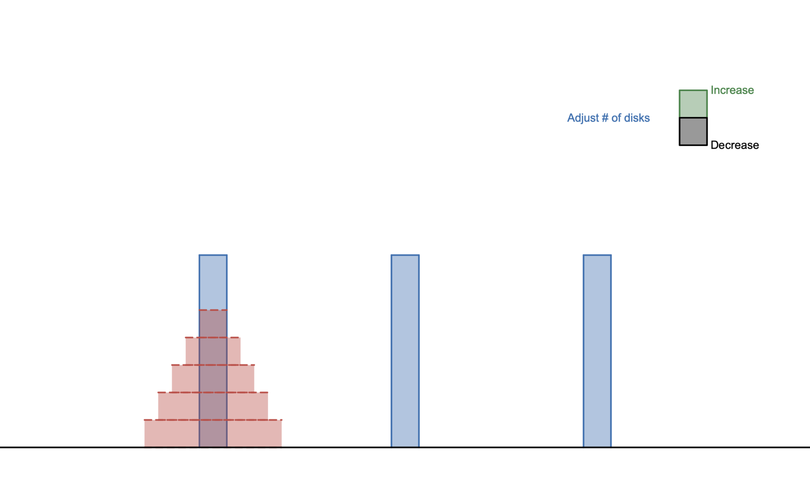

# Desmos-Tower-of-Hanoi
Recently I saw a [video](https://www.youtube.com/watch?v=36hoyq2xZY4) in which the creator made a game using the Desmos graphing calculator. I have been using Desmos for graphing for a while now but I had never though of using it that way. So I decided to further explore these functionalities of desmos which I was unaware of and I created a small game, the Tower of Hanoi.

## How it works
If you know some math and how to code then all you need is some understanding of "Actions" in desmos, for which there is a kind of [documentation](https://help.desmos.com/hc/en-us/articles/4407725009165-Actions#h_01FB2RRQ5ZHN6Q66WWWK545SGY) for it.
 
There is a game loop option, just like any other game, and some clickability available for graphs which allows for changes to happen. It's pretty simple and not really useful for anything in the real world but it was nice to learn more about the Desmos graphing calculator which I tend to use quite often for maths. So making a simple game with some of the worst "math coding" practices was quite educative. Of course with these functionalities it is possible to go on and make almost anything on desmos but there really is no need to go that far since it's not useful.
 
To play you need to first adjust the amount of disks you'll be playing with, anywhere between 3 to 8 using a counter on the top right. Then you can move the disks around by clicking on the pillars. The purpose of the game is to move all of the disks from the first to the third pillar while moving only one disk at a time and not placing any disks of greater size on top the smaller ones. Also, you can only grab disks from the top like a stack.
 
My game can be seen [here](https://www.desmos.com/calculator/njvqiyfasy).

